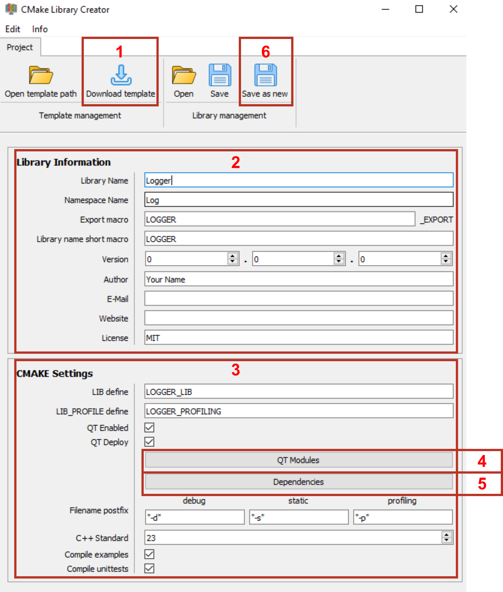

### Note
**All descriptions of how to use the application and what individual files are called was made using a sample library called Logger.
File names that contain loggers would accordingly be called differently in your project.**

# Create a library project
First a little overview over the workflow with the tool.

   
You can find details about what each field represents in the section: [Library Information](InputElements.md) 

1. **Download** the latest template files. This will download the contents from the template library repository.
2. Fill out the fields. If you write the library name, some other fields will get filled automaticly. You can change them if you want. 
3. Here you can specify how to build the library and what dependencies it needs.
4. If your project is uses QT, you can select which modules you need.
5. If your project needs external libraries as dependency, you can select from a predefined list of dependencies.
6. To generate the new Project, click on the **Save as new** button.
   This opens a file dialog. Change to the location in which you want the Library generated in.
   If you select: **"...AnyFolder/Libraries"** then the Library will be generated in:
   **"...AnyFolder/Libraries/Logger"**
   With the root CMakeLists.txt file in the folder **"Logger"**
7. Done, you can now open your cmake project using Visual Studio.
