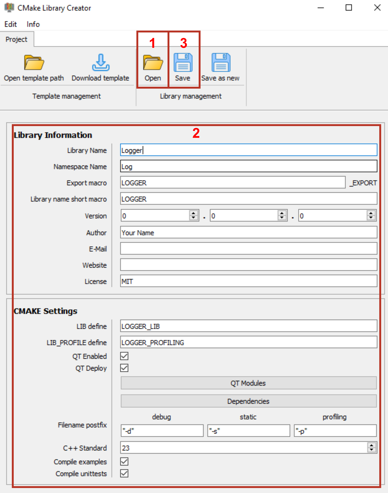

### Note
**All descriptions of how to use the application and what individual files are called was made using a sample library called Logger.
File names that contain loggers would accordingly be called differently in your project.**

### Important

Make shure you have saved any changes in your library, eg. git or any other backup.

In some edge cases it is possible that the parser may interpret something wrong.
That can create damage to your library. If you have saved all changes beforehand you can **discard all changes** using git to restore the library.

# Edit a library project
First a little overview over the workflow with the tool.

   
You can find details about what each field represents in the section: [Library Information](InputElements.md) 

1. Click the **Open** button and navigate to the directory where the root CMakeLists.txt file from your library is located.
   Your Project gets loaded.
2. Make your changes on the settings.
3. Click the **Save** button to save the changes back to your library