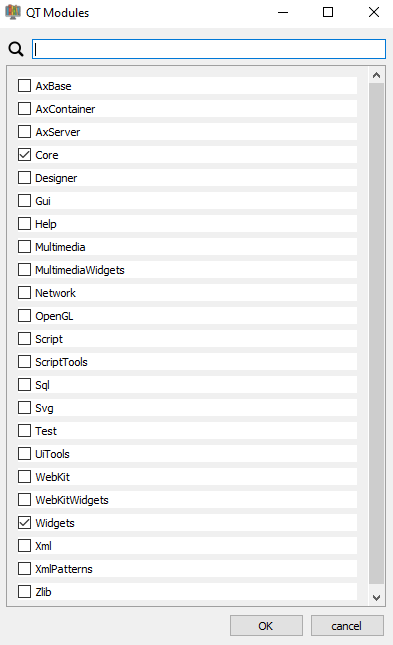

## Table of content
- [Library Information](#library-information)
  - [Library Name](#library-name)
  - [Namespace Name](#namespace-name)
  - [Export macro](#export-macro)
  - [Library name short macro](#library-name-short-macro)
  - [Version](#version)
  - [Author, Mail, Website, License](#author-mail-website-license)
- [Cmake Settings](#cmake-settings)
  - [LIB define](#lib-define)
  - [LIB\_PROFILE define](#lib_profile-define)
  - [QT enabled](#qt-enabled)
  - [QT deploy](#qt-deploy)
  - [QT Modules](#qt-modules)
  - [Dependencies](#dependencies)
  - [Filename postfix](#filename-postfix)
  - [C++ Standard](#c-standard)
  - [Compile examples](#compile-examples)
  - [Compile unittests](#compile-unittests)
  
# Library Information
## Library Name
**- This field is required**
**- No special characters, just letters, numbers and "_". must start with a letter.**
As you may be already guessed, this is the name of the library. This name is used for the Cmake Build targets. It is also used to generate the names of the template header files.
If you call your Project "Logger", you would have to include the "Logger.h" header file in your project that uses the library.

## Namespace Name
**- This field is required**
**- No special characters, just letters, numbers and "_". must start with a letter.**
Your entire library shuld be encapsulated inside a namespace that will have the name you put here.

## Export macro
**- This field is required**
**- No special characters, just upper case letters, numbers and "_". must start with a letter.**
This parameter represents the export macro for your library.
You **must not** write the "_EXPORT" ending of the name. **Only write "LOGGER"**.
``` c++
#ifndef BUILD_STATIC
	#pragma message("LOGGER_LIB is a shared library")
	#if defined(LOGGER_LIB)
		#define LOGGER_EXPORT __declspec(dllexport)
	#else
		#define LOGGER_EXPORT __declspec(dllimport)
	#endif
#else 
	#pragma message("LOGGER_LIB is a static library")
	#define LOGGER_EXPORT
#endif
```

## Library name short macro
**- This field is required**
**- No special characters, just upper case letters, numbers and "_". must start with a letter.**
This is a shorter form of the library name, used for special macros inside the library.
You can also type the same thing as you wrote in the [Export Macro](#exportMacro) section but it is sometimes nice to have a shorter form because the macro names can sometimes become very long.
For example: 
``` c++
// Defined in Logger_global.h
#define LOGGER_UNUSED(x) (void)x; 

// Defined in Logger_debug.h
// Debugging
#ifdef NDEBUG
	#define LOGGER_CONSOLE(msg)
	#define LOGGER_CONSOLE_FUNCTION(msg)
#else
	#include <iostream>

	#define LOGGER_DEBUG
	#define LOGGER_CONSOLE_STREAM std::cout

	#define LOGGER_CONSOLE(msg) LOGGER_CONSOLE_STREAM << msg;
	#define LOGGER_CONSOLE_FUNCTION(msg) LOGGER_CONSOLE_STREAM << __PRETTY_FUNCTION__ << " " << msg;
#endif
```
There are some more examples where the short form is used. You can read about that in detail in the documentation of the [template library](https://github.com/KROIA/QT_cmake_library_template).

## Version
Here you can put in the version of your library. 
You also can change this parameter in code.
versionMajor <=> Field on the left
versionMinor <=> Field in the middle
versionPatch <=> Field on the right
The values get put in the file: **Logger_info.h**:
``` c++
namespace Log
{
    ...
    class LOGGER_EXPORT LibraryInfo
    {
	    LibraryInfo() = delete;
	    LibraryInfo(const LibraryInfo&) = delete;
	public:
	    // Current version of the library
	    static constexpr int versionMajor				= 0;
	    static constexpr int versionMinor				= 0;
	    static constexpr int versionPatch				= 0;
        ...        
    };
}
```

## Author, Mail, Website, License
**- These fields are not required**
Here you can put any string. 
You also can change this parameters in code.
The values get put in the file: **Logger_info.h**:
``` c++
namespace Log
{
    ...
    class LOGGER_EXPORT LibraryInfo
    {
        ...
        static constexpr const char* name       = "Logger";
        static constexpr const char* author     = "Your Name";
        static constexpr const char* email      = "";
        static constexpr const char* website	= "";
        static constexpr const char* license	= "MIT";
        ...        
    };
}
```

# Cmake Settings
## LIB define
This is a macro definition that is only active for building the library.
This will switch the export/import of the library dll.
Used in **Logger_global.h**
``` c++
...
#if defined(LOGGER_LIB)
	#define LOGGER_EXPORT __declspec(dllexport)
#else
	#define LOGGER_EXPORT __declspec(dllimport)
#endif
...
```

## LIB_PROFILE define
This is a macro definition that is only active if the configuration in Visual Studio is swithced to debug/release-profile.
If this macro is defined, Profiling using the [easy_profiler library](https://github.com/yse/easy_profiler) is enabled. To use the profiler functionality, add the [easy_profiler dependency](#dependencies).
Used in **Logger_debug.h**
``` c++
...
#ifdef LOGGER_PROFILING
    #include "easy/profiler.h"
    #include <easy/arbitrary_value.h> // EASY_VALUE, EASY_ARRAY are defined here

    #define LOGGER_PROFILING_BLOCK_C(text, color) EASY_BLOCK(text, color)
    #define LOGGER_PROFILING_NONSCOPED_BLOCK_C(text, color) EASY_NONSCOPED_BLOCK(text, color)
    #define LOGGER_PROFILING_END_BLOCK EASY_END_BLOCK
    #define LOGGER_PROFILING_FUNCTION_C(color) EASY_FUNCTION(color)
    #define LOGGER_PROFILING_BLOCK(text, colorStage) LOGGER_PROFILING_BLOCK_C(text,profiler::colors::  colorStage)
    #define LOGGER_PROFILING_NONSCOPED_BLOCK(text, colorStage) LOGGER_PROFILING_NONSCOPED_BLOCK_C(text,profiler::colors::  colorStage)
    #define LOGGER_PROFILING_FUNCTION(colorStage) LOGGER_PROFILING_FUNCTION_C(profiler::colors:: colorStage)
    #define LOGGER_PROFILING_THREAD(name) EASY_THREAD(name)

    #define LOGGER_PROFILING_VALUE(name, value) EASY_VALUE(name, value)
    #define LOGGER_PROFILING_TEXT(name, value) EASY_TEXT(name, value)

#else
    // Disable all profiling macros
    #define LOGGER_PROFILING_BLOCK_C(text, color)
    #define LOGGER_PROFILING_NONSCOPED_BLOCK_C(text, color)
    #define LOGGER_PROFILING_END_BLOCK
    #define LOGGER_PROFILING_FUNCTION_C(color)
    #define LOGGER_PROFILING_BLOCK(text, colorStage)
    #define LOGGER_PROFILING_NONSCOPED_BLOCK(text, colorStage)
    #define LOGGER_PROFILING_FUNCTION(colorStage)
    #define LOGGER_PROFILING_THREAD(name)

    #define LOGGER_PROFILING_VALUE(name, value)
    #define LOGGER_PROFILING_TEXT(name, value)
#endif
...
```

## QT enabled
If the library you create uses some QT5 dependencies, you have to check that checkbox.

## QT deploy
If you want to deploy your exe files in the example/unitTest folder using **windeployqt.exe**, then check this checkbox. Using the deployment allows you to start a Qt application from within Visual Studio. The QT Creator would not need to have the QT dll's in the same folder as the executable because it already knows where to find the dll's. This is not true for Visual Studio, so deployment is needed to copy all needed resources from Qt to the binary folder.
**If you create a clean build, you have to install your compiled binary first, to be able to run the application.**
Install: Go to **Visual Studio -> Build->"Logger Install"**
This will trigger the deployment.


## QT Modules

If your library uses QT you may wan't to specify which modules are required.
You can select the modules you need.
**Core** and **Widgets** are the most common used modules.
If you need a module that is not in this list, you can add it manually to the file:
**LibraryRoot/CMakeLists.txt**:
``` cmake
...
# Needed QT modules                             # <AUTO_REPLACED> 
set(QT_MODULES
  Core
  Widgets)
...
``` 
It would be nice to contact me so I can add any missing modules to the [repo](https://github.com/KROIA/QT_cmake_library_template/tree/qtModules) where the list from the UI gets generated from.

## Dependencies

If you want to use some external libraries, you can select them here.
**easy_profiler** is required to be able to build a library that uses the profiler.
If you don't want to profile your library, you don't need the dependency.

Your desired library is not available? 
[Click here to learn how to add custom dependencies](https://github.com/KROIA/QT_cmake_library_template/Documentation/dependencies.md)


## Filename postfix
The postfixes are added to the filename of the library binary.
For example:
    - Debug builds will have the postfix **-d**: **Logger-d.lib**
    - For the static build with Debug info: **Logger-s-d.lib**
    - For the static build with Debug and profiling enabled: **Logger-s-p-d.lib**

The same for the dll files.

## C++ Standard
Defines which c++ standard you want to use for building the library.

## Compile examples
If not set, cmake will not include the directory **Examples** in its build process.
## Compile unittests
If not set, cmake will not include the directory **UnitTests** in its build process.
